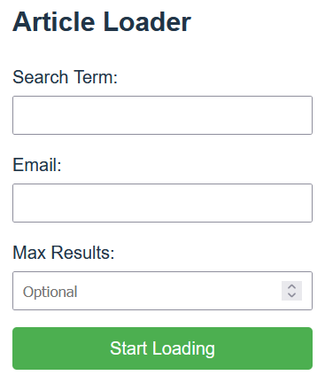
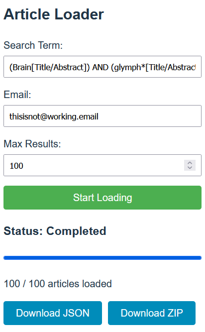

# Pubmed Downloader


### Getting Started
To start the PubMed downloader simply run:
```bash 
docker compose up -d 
```
The PubMed downloader will be available at http://localhost:5111

### Usage

* In the **Search Term** field put in your usual PubMed search query. 
    * Brackets (), 
    * boolean operators like AND, OR 
    * and search field clarifications like \<search_term\>[Title/Abstract] all work the same as in the normal PubMed Query
* In the **Email** field put in any email address. It does not need to work, it 
just needs to follow the usual xxxxx@xxx.xxx format
* The **Max Results** field is optional, you can use it to limit the number of 
papers downloaded. But when you use Max Results it will tend to download older papers first. 

After loading the articles you can download the data in form of a JSON file or a ZIP file.  


The downloaded files will contain several bibliometric data points as well as the abstract of the publication. 
Downloaded values include: 
* PubMed ID
* Title
* Abstract
* Authors
* PublicationDate
* Keywords
* Journal

